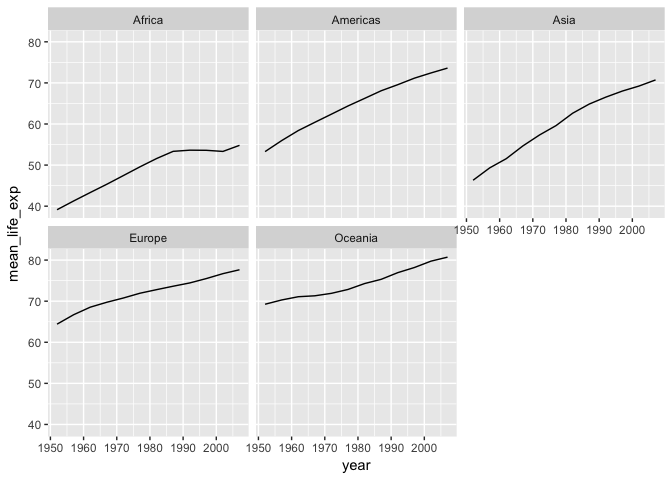

Lets say we want to calculate the average GDP/capita for each continent. lets use subsetting, first lets make sure we have gapminder loaded

# Subsetting and calculating means (2:30-2:35)


```r
library(gapminder)
#update this based on how Zena taught subsetting
mean(gapminder$gdpPercap)
```

```
## [1] 7215.327
```

```r
gapminder[gapminder$continent == "Africa",]
```

```
## # A tibble: 624 x 6
##    country continent  year lifeExp      pop gdpPercap
##     <fctr>    <fctr> <int>   <dbl>    <int>     <dbl>
##  1 Algeria    Africa  1952  43.077  9279525  2449.008
##  2 Algeria    Africa  1957  45.685 10270856  3013.976
##  3 Algeria    Africa  1962  48.303 11000948  2550.817
##  4 Algeria    Africa  1967  51.407 12760499  3246.992
##  5 Algeria    Africa  1972  54.518 14760787  4182.664
##  6 Algeria    Africa  1977  58.014 17152804  4910.417
##  7 Algeria    Africa  1982  61.368 20033753  5745.160
##  8 Algeria    Africa  1987  65.799 23254956  5681.359
##  9 Algeria    Africa  1992  67.744 26298373  5023.217
## 10 Algeria    Africa  1997  69.152 29072015  4797.295
## # ... with 614 more rows
```

```r
#alternate method
subset(gapminder, continent == 'Africa')
```

```
## # A tibble: 624 x 6
##    country continent  year lifeExp      pop gdpPercap
##     <fctr>    <fctr> <int>   <dbl>    <int>     <dbl>
##  1 Algeria    Africa  1952  43.077  9279525  2449.008
##  2 Algeria    Africa  1957  45.685 10270856  3013.976
##  3 Algeria    Africa  1962  48.303 11000948  2550.817
##  4 Algeria    Africa  1967  51.407 12760499  3246.992
##  5 Algeria    Africa  1972  54.518 14760787  4182.664
##  6 Algeria    Africa  1977  58.014 17152804  4910.417
##  7 Algeria    Africa  1982  61.368 20033753  5745.160
##  8 Algeria    Africa  1987  65.799 23254956  5681.359
##  9 Algeria    Africa  1992  67.744 26298373  5023.217
## 10 Algeria    Africa  1997  69.152 29072015  4797.295
## # ... with 614 more rows
```

```r
gapminder[gapminder$continent == "Africa",]$gdpPercap
```

```
##   [1]  2449.0082  3013.9760  2550.8169  3246.9918  4182.6638  4910.4168
##   [7]  5745.1602  5681.3585  5023.2166  4797.2951  5288.0404  6223.3675
##  [13]  3520.6103  3827.9405  4269.2767  5522.7764  5473.2880  3008.6474
##  [19]  2756.9537  2430.2083  2627.8457  2277.1409  2773.2873  4797.2313
##  [25]  1062.7522   959.6011   949.4991  1035.8314  1085.7969  1029.1613
##  [31]  1277.8976  1225.8560  1191.2077  1232.9753  1372.8779  1441.2849
##  [37]   851.2411   918.2325   983.6540  1214.7093  2263.6111  3214.8578
##  [43]  4551.1421  6205.8839  7954.1116  8647.1423 11003.6051 12569.8518
##  [49]   543.2552   617.1835   722.5120   794.8266   854.7360   743.3870
##  [55]   807.1986   912.0631   931.7528   946.2950  1037.6452  1217.0330
##  [61]   339.2965   379.5646   355.2032   412.9775   464.0995   556.1033
##  [67]   559.6032   621.8188   631.6999   463.1151   446.4035   430.0707
##  [73]  1172.6677  1313.0481  1399.6074  1508.4531  1684.1465  1783.4329
##  [79]  2367.9833  2602.6642  1793.1633  1694.3375  1934.0114  2042.0952
##  [85]  1071.3107  1190.8443  1193.0688  1136.0566  1070.0133  1109.3743
##  [91]   956.7530   844.8764   747.9055   740.5063   738.6906   706.0165
##  [97]  1178.6659  1308.4956  1389.8176  1196.8106  1104.1040  1133.9850
## [103]   797.9081   952.3861  1058.0643  1004.9614  1156.1819  1704.0637
## [109]  1102.9909  1211.1485  1406.6483  1876.0296  1937.5777  1172.6030
## [115]  1267.1001  1315.9808  1246.9074  1173.6182  1075.8116   986.1479
## [121]   780.5423   905.8602   896.3146   861.5932   904.8961   795.7573
## [127]   673.7478   672.7748   457.7192   312.1884   241.1659   277.5519
## [133]  2125.6214  2315.0566  2464.7832  2677.9396  3213.1527  3259.1790
## [139]  4879.5075  4201.1949  4016.2395  3484.1644  3484.0620  3632.5578
## [145]  1388.5947  1500.8959  1728.8694  2052.0505  2378.2011  2517.7365
## [151]  2602.7102  2156.9561  1648.0738  1786.2654  1648.8008  1544.7501
## [157]  2669.5295  2864.9691  3020.9893  3020.0505  3694.2124  3081.7610
## [163]  2879.4681  2880.1026  2377.1562  1895.0170  1908.2609  2082.4816
## [169]  1418.8224  1458.9153  1693.3359  1814.8807  2024.0081  2785.4936
## [175]  3503.7296  3885.4607  3794.7552  4173.1818  4754.6044  5581.1810
## [181]   375.6431   426.0964   582.8420   915.5960   672.4123   958.5668
## [187]   927.8253   966.8968  1132.0550  2814.4808  7703.4959 12154.0897
## [193]   328.9406   344.1619   380.9958   468.7950   514.3242   505.7538
## [199]   524.8758   521.1341   582.8585   913.4708   765.3500   641.3695
## [205]   362.1463   378.9042   419.4564   516.1186   566.2439   556.8084
## [211]   577.8607   573.7413   421.3535   515.8894   530.0535   690.8056
## [217]  4293.4765  4976.1981  6631.4592  8358.7620 11401.9484 21745.5733
## [223] 15113.3619 11864.4084 13522.1575 14722.8419 12521.7139 13206.4845
## [229]   485.2307   520.9267   599.6503   734.7829   756.0868   884.7553
## [235]   835.8096   611.6589   665.6244   653.7302   660.5856   752.7497
## [241]   911.2989  1043.5615  1190.0411  1125.6972  1178.2237   993.2240
## [247]   876.0326   847.0061   925.0602  1005.2458  1111.9846  1327.6089
## [253]   510.1965   576.2670   686.3737   708.7595   741.6662   874.6859
## [259]   857.2504   805.5725   794.3484   869.4498   945.5836   942.6542
## [265]   299.8503   431.7905   522.0344   715.5806   820.2246   764.7260
## [271]   838.1240   736.4154   745.5399   796.6645   575.7047   579.2317
## [277]   853.5409   944.4383   896.9664  1056.7365  1222.3600  1267.6132
## [283]  1348.2258  1361.9369  1341.9217  1360.4850  1287.5147  1463.2493
## [289]   298.8462   335.9971   411.8006   498.6390   496.5816   745.3695
## [295]   797.2631   773.9932   977.4863  1186.1480  1275.1846  1569.3314
## [301]   575.5730   620.9700   634.1952   713.6036   803.0055   640.3224
## [307]   572.1996   506.1139   636.6229   609.1740   531.4824   414.5073
## [313]  2387.5481  3448.2844  6757.0308 18772.7517 21011.4972 21951.2118
## [319] 17364.2754 11770.5898  9640.1385  9467.4461  9534.6775 12057.4993
## [325]  1443.0117  1589.2027  1643.3871  1634.0473  1748.5630  1544.2286
## [331]  1302.8787  1155.4419  1040.6762   986.2959   894.6371  1044.7701
## [337]   369.1651   416.3698   427.9011   495.5148   584.6220   663.2237
## [343]   632.8039   635.5174   563.2000   692.2758   665.4231   759.3499
## [349]   452.3370   490.3822   496.1743   545.0099   581.3689   686.3953
## [355]   618.0141   684.1716   739.0144   790.2580   951.4098  1042.5816
## [361]   743.1159   846.1203  1055.8960  1421.1452  1586.8518  1497.4922
## [367]  1481.1502  1421.6036  1361.3698  1483.1361  1579.0195  1803.1515
## [373]  1967.9557  2034.0380  2529.0675  2475.3876  2575.4842  3710.9830
## [379]  3688.0377  4783.5869  6058.2538  7425.7053  9021.8159 10956.9911
## [385]  1688.2036  1642.0023  1566.3535  1711.0448  1930.1950  2370.6200
## [391]  2702.6204  2755.0470  2948.0473  2982.1019  3258.4956  3820.1752
## [397]   468.5260   495.5868   556.6864   566.6692   724.9178   502.3197
## [403]   462.2114   389.8762   410.8968   472.3461   633.6179   823.6856
## [409]  2423.7804  2621.4481  3173.2156  3793.6948  3746.0809  3876.4860
## [415]  4191.1005  3693.7313  3804.5380  3899.5243  4072.3248  4811.0604
## [421]   761.8794   835.5234   997.7661  1054.3849   954.2092   808.8971
## [427]   909.7221   668.3000   581.1827   580.3052   601.0745   619.6769
## [433]  1077.2819  1100.5926  1150.9275  1014.5141  1698.3888  1981.9518
## [439]  1576.9738  1385.0296  1619.8482  1624.9413  1615.2864  2013.9773
## [445]  2718.8853  2769.4518  3173.7233  4021.1757  5047.6586  4319.8041
## [451]  5267.2194  5303.3775  6101.2558  6071.9414  6316.1652  7670.1226
## [457]   493.3239   540.2894   597.4731   510.9637   590.5807   670.0806
## [463]   881.5706   847.9912   737.0686   589.9445   785.6538   863.0885
## [469]   879.5836   860.7369  1071.5511  1384.8406  1532.9853  1737.5617
## [475]  1890.2181  1516.5255  1428.7778  1339.0760  1353.0924  1598.4351
## [481]  1450.3570  1567.6530  1654.9887  1612.4046  1597.7121  1561.7691
## [487]  1518.4800  1441.7207  1367.8994  1392.3683  1519.6353  1712.4721
## [493]   879.7877  1004.4844  1116.6399  1206.0435  1353.7598  1348.2852
## [499]  1465.0108  1294.4478  1068.6963   574.6482   699.4897   862.5408
## [505]  1135.7498  1258.1474  1369.4883  1284.7332  1254.5761  1450.9925
## [511]  1176.8070  1093.2450   926.9603   930.5964   882.0818   926.1411
## [517]  4725.2955  5487.1042  5768.7297  7114.4780  7765.9626  8028.6514
## [523]  8568.2662  7825.8234  7225.0693  7479.1882  7710.9464  9269.6578
## [529]  1615.9911  1770.3371  1959.5938  1687.9976  1659.6528  2202.9884
## [535]  1895.5441  1507.8192  1492.1970  1632.2108  1993.3983  2602.3950
## [541]  1148.3766  1244.7084  1856.1821  2613.1017  3364.8366  3781.4106
## [547]  3895.3840  3984.8398  3553.0224  3876.7685  4128.1169  4513.4806
## [553]   716.6501   698.5356   722.0038   848.2187   915.9851   962.4923
## [559]   874.2426   831.8221   825.6825   789.1862   899.0742  1107.4822
## [565]   859.8087   925.9083  1067.5348  1477.5968  1649.6602  1532.7770
## [571]  1344.5780  1202.2014  1034.2989   982.2869   886.2206   882.9699
## [577]  1468.4756  1395.2325  1660.3032  1932.3602  2753.2860  3120.8768
## [583]  3560.2332  3810.4193  4332.7202  4876.7986  5722.8957  7092.9230
## [589]   734.7535   774.3711   767.2717   908.9185   950.7359   843.7331
## [595]   682.2662   617.7244   644.1708   816.5591   927.7210  1056.3801
## [601]  1147.3888  1311.9568  1452.7258  1777.0773  1773.4983  1588.6883
## [607]  1408.6786  1213.3151  1210.8846  1071.3538  1071.6139  1271.2116
## [613]   406.8841   518.7643   527.2722   569.7951   799.3622   685.5877
## [619]   788.8550   706.1573   693.4208   792.4500   672.0386   469.7093
```

```r
mean(gapminder[gapminder$continent == "Africa",]$gdpPercap)
```

```
## [1] 2193.755
```

Now lets do it for the Americas


```r
mean(gapminder[gapminder$continent == "Americas",]$gdpPercap)
```

```
## [1] 7136.11
```

```r
#now for asia
mean(gapminder[gapminder$continent == "Asia",]$gdpPercap)
```

```
## [1] 7902.15
```


Here there is lots of repeating yourself, so to do this more reproducibly we are going to use a package called dplyr


```r
#install.packages('dplyr')
library(dplyr)
```

```
## 
## Attaching package: 'dplyr'
```

```
## The following objects are masked from 'package:stats':
## 
##     filter, lag
```

```
## The following objects are masked from 'package:base':
## 
##     intersect, setdiff, setequal, union
```

There are several commands including select, filter and group_by/summarize that we are going to go through today.

# Select (2:35-2:40)


```r
year_country_gdp <- select(gapminder,year,country,gdpPercap)
gapminder
```

```
## # A tibble: 1,704 x 6
##        country continent  year lifeExp      pop gdpPercap
##         <fctr>    <fctr> <int>   <dbl>    <int>     <dbl>
##  1 Afghanistan      Asia  1952  28.801  8425333  779.4453
##  2 Afghanistan      Asia  1957  30.332  9240934  820.8530
##  3 Afghanistan      Asia  1962  31.997 10267083  853.1007
##  4 Afghanistan      Asia  1967  34.020 11537966  836.1971
##  5 Afghanistan      Asia  1972  36.088 13079460  739.9811
##  6 Afghanistan      Asia  1977  38.438 14880372  786.1134
##  7 Afghanistan      Asia  1982  39.854 12881816  978.0114
##  8 Afghanistan      Asia  1987  40.822 13867957  852.3959
##  9 Afghanistan      Asia  1992  41.674 16317921  649.3414
## 10 Afghanistan      Asia  1997  41.763 22227415  635.3414
## # ... with 1,694 more rows
```

```r
year_country_gdp
```

```
## # A tibble: 1,704 x 3
##     year     country gdpPercap
##    <int>      <fctr>     <dbl>
##  1  1952 Afghanistan  779.4453
##  2  1957 Afghanistan  820.8530
##  3  1962 Afghanistan  853.1007
##  4  1967 Afghanistan  836.1971
##  5  1972 Afghanistan  739.9811
##  6  1977 Afghanistan  786.1134
##  7  1982 Afghanistan  978.0114
##  8  1987 Afghanistan  852.3959
##  9  1992 Afghanistan  649.3414
## 10  1997 Afghanistan  635.3414
## # ... with 1,694 more rows
```

What did this do?  Select picks out a subset of columns.  See image at `https://swcarpentry.github.io/r-novice-gapminder/fig/13-dplyr-fig1.png`


# Filter (2:40-2:45)

Filters can select a subset of rows.


```r
gapminder_euro <- filter(gapminder, continent=="Europe")
#similar to subset
gapminder_euro <- subset(gapminder, continent=="Europe")

#written another way with pipes
gapminder_euro <- gapminder %>% filter(continent=="Europe")
```

## Pipes

These allow you to chain several functions together


```r
year_country_gdp_euro <- 
  gapminder %>%
  filter(continent=="Europe") %>%
  select(year,country,gdpPercap)
```

# Challenge 1 (2:45-2:50)


```challenge
Write a single command (which can span multiple lines and includes pipes) that will produce a dataframe that has the African values for lifeExp, country and year, but not for other Continents. How many rows does your dataframe have and why?
```

# Group By with Summarize (2:50-3:00)

Now lets look at the combination of group_by and summarize


```r
gapminder
```

```
## # A tibble: 1,704 x 6
##        country continent  year lifeExp      pop gdpPercap
##         <fctr>    <fctr> <int>   <dbl>    <int>     <dbl>
##  1 Afghanistan      Asia  1952  28.801  8425333  779.4453
##  2 Afghanistan      Asia  1957  30.332  9240934  820.8530
##  3 Afghanistan      Asia  1962  31.997 10267083  853.1007
##  4 Afghanistan      Asia  1967  34.020 11537966  836.1971
##  5 Afghanistan      Asia  1972  36.088 13079460  739.9811
##  6 Afghanistan      Asia  1977  38.438 14880372  786.1134
##  7 Afghanistan      Asia  1982  39.854 12881816  978.0114
##  8 Afghanistan      Asia  1987  40.822 13867957  852.3959
##  9 Afghanistan      Asia  1992  41.674 16317921  649.3414
## 10 Afghanistan      Asia  1997  41.763 22227415  635.3414
## # ... with 1,694 more rows
```

```r
gapminder %>% group_by(continent)
```

```
## # A tibble: 1,704 x 6
## # Groups:   continent [5]
##        country continent  year lifeExp      pop gdpPercap
##         <fctr>    <fctr> <int>   <dbl>    <int>     <dbl>
##  1 Afghanistan      Asia  1952  28.801  8425333  779.4453
##  2 Afghanistan      Asia  1957  30.332  9240934  820.8530
##  3 Afghanistan      Asia  1962  31.997 10267083  853.1007
##  4 Afghanistan      Asia  1967  34.020 11537966  836.1971
##  5 Afghanistan      Asia  1972  36.088 13079460  739.9811
##  6 Afghanistan      Asia  1977  38.438 14880372  786.1134
##  7 Afghanistan      Asia  1982  39.854 12881816  978.0114
##  8 Afghanistan      Asia  1987  40.822 13867957  852.3959
##  9 Afghanistan      Asia  1992  41.674 16317921  649.3414
## 10 Afghanistan      Asia  1997  41.763 22227415  635.3414
## # ... with 1,694 more rows
```

Lets look at the structure using the `str` command


```r
str(gapminder)
```

```
## Classes 'tbl_df', 'tbl' and 'data.frame':	1704 obs. of  6 variables:
##  $ country  : Factor w/ 142 levels "Afghanistan",..: 1 1 1 1 1 1 1 1 1 1 ...
##  $ continent: Factor w/ 5 levels "Africa","Americas",..: 3 3 3 3 3 3 3 3 3 3 ...
##  $ year     : int  1952 1957 1962 1967 1972 1977 1982 1987 1992 1997 ...
##  $ lifeExp  : num  28.8 30.3 32 34 36.1 ...
##  $ pop      : int  8425333 9240934 10267083 11537966 13079460 14880372 12881816 13867957 16317921 22227415 ...
##  $ gdpPercap: num  779 821 853 836 740 ...
```

```r
str(gapminder %>% group_by(continent))
```

```
## Classes 'grouped_df', 'tbl_df', 'tbl' and 'data.frame':	1704 obs. of  6 variables:
##  $ country  : Factor w/ 142 levels "Afghanistan",..: 1 1 1 1 1 1 1 1 1 1 ...
##  $ continent: Factor w/ 5 levels "Africa","Americas",..: 3 3 3 3 3 3 3 3 3 3 ...
##  $ year     : int  1952 1957 1962 1967 1972 1977 1982 1987 1992 1997 ...
##  $ lifeExp  : num  28.8 30.3 32 34 36.1 ...
##  $ pop      : int  8425333 9240934 10267083 11537966 13079460 14880372 12881816 13867957 16317921 22227415 ...
##  $ gdpPercap: num  779 821 853 836 740 ...
##  - attr(*, "vars")= chr "continent"
##  - attr(*, "drop")= logi TRUE
##  - attr(*, "indices")=List of 5
##   ..$ : int  24 25 26 27 28 29 30 31 32 33 ...
##   ..$ : int  48 49 50 51 52 53 54 55 56 57 ...
##   ..$ : int  0 1 2 3 4 5 6 7 8 9 ...
##   ..$ : int  12 13 14 15 16 17 18 19 20 21 ...
##   ..$ : int  60 61 62 63 64 65 66 67 68 69 ...
##  - attr(*, "group_sizes")= int  624 300 396 360 24
##  - attr(*, "biggest_group_size")= int 624
##  - attr(*, "labels")='data.frame':	5 obs. of  1 variable:
##   ..$ continent: Factor w/ 5 levels "Africa","Americas",..: 1 2 3 4 5
##   ..- attr(*, "vars")= chr "continent"
##   ..- attr(*, "drop")= logi TRUE
```

This is kinda boring but the power is that now things are grouped you can calculate things.  Show the image at `https://swcarpentry.github.io/r-novice-gapminder/fig/13-dplyr-fig3.png`


```r
gdp_bycontinents <- 
  gapminder %>%
  group_by(continent) %>%
  summarize(mean_gdpPercap=mean(gdpPercap))
gdp_bycontinents
```

```
## # A tibble: 5 x 2
##   continent mean_gdpPercap
##      <fctr>          <dbl>
## 1    Africa       2193.755
## 2  Americas       7136.110
## 3      Asia       7902.150
## 4    Europe      14469.476
## 5   Oceania      18621.609
```

Now lets sort these high to low


```r
gdp_bycontinents <- 
  gapminder %>%
  group_by(continent) %>%
  summarize(mean_gdpPercap=mean(gdpPercap)) %>%
  arrange(desc(mean_gdpPercap))
gdp_bycontinents
```

```
## # A tibble: 5 x 2
##   continent mean_gdpPercap
##      <fctr>          <dbl>
## 1   Oceania      18621.609
## 2    Europe      14469.476
## 3      Asia       7902.150
## 4  Americas       7136.110
## 5    Africa       2193.755
```

Now lets do a couple of different calculations


```r
gdp_bycontinents <- 
  gapminder %>%
  group_by(continent) %>%
  summarize(mean_gdpPercap=mean(gdpPercap),
            max_gdpPercap=max(gdpPercap),
            min_gdpPercap=min(gdpPercap))
gdp_bycontinents
```

```
## # A tibble: 5 x 4
##   continent mean_gdpPercap max_gdpPercap min_gdpPercap
##      <fctr>          <dbl>         <dbl>         <dbl>
## 1    Africa       2193.755      21951.21      241.1659
## 2  Americas       7136.110      42951.65     1201.6372
## 3      Asia       7902.150     113523.13      331.0000
## 4    Europe      14469.476      49357.19      973.5332
## 5   Oceania      18621.609      34435.37    10039.5956
```

# Group By and Summarize Challenge (3:00-3:05)


```challenge
Calculate the average life expectancy per country. Which has the longest average life expectancy and which has the shortest average life expectancy?
```

# Multiple variables (3:05-3:10)


```r
#lets group by multiple variables, here lets now incude year and contienent
gdp_bycontinents_years <- 
  gapminder %>%
  group_by(continent,year) %>%
  summarize(mean_gdpPercap=mean(gdpPercap)) %>%
  arrange(desc(mean_gdpPercap))
gdp_bycontinents_years
```

```
## # A tibble: 60 x 3
## # Groups:   continent [5]
##    continent  year mean_gdpPercap
##       <fctr> <int>          <dbl>
##  1   Oceania  2007       29810.19
##  2   Oceania  2002       26938.78
##  3    Europe  2007       25054.48
##  4   Oceania  1997       24024.18
##  5    Europe  2002       21711.73
##  6   Oceania  1992       20894.05
##  7   Oceania  1987       20448.04
##  8    Europe  1997       19076.78
##  9   Oceania  1982       18554.71
## 10   Oceania  1977       17283.96
## # ... with 50 more rows
```

# Mutate (3:10-3:20)

Mutate adds a new column


```r
gdp_bycontinents <- 
  gapminder %>%
  group_by(continent) %>%
  summarize(mean_gdpPercap=mean(gdpPercap),
            max_gdpPercap=max(gdpPercap),
            min_gdpPercap=min(gdpPercap)) 
gdp_bycontinents
```

```
## # A tibble: 5 x 4
##   continent mean_gdpPercap max_gdpPercap min_gdpPercap
##      <fctr>          <dbl>         <dbl>         <dbl>
## 1    Africa       2193.755      21951.21      241.1659
## 2  Americas       7136.110      42951.65     1201.6372
## 3      Asia       7902.150     113523.13      331.0000
## 4    Europe      14469.476      49357.19      973.5332
## 5   Oceania      18621.609      34435.37    10039.5956
```

```r
gdp_bycontinents <- 
  gapminder %>%
  group_by(continent) %>%
  summarize(mean_gdpPercap=mean(gdpPercap),
            max_gdpPercap=max(gdpPercap),
            min_gdpPercap=min(gdpPercap)) %>%
  mutate(diff_gdpPercap=max_gdpPercap-min_gdpPercap)
gdp_bycontinents
```

```
## # A tibble: 5 x 5
##   continent mean_gdpPercap max_gdpPercap min_gdpPercap diff_gdpPercap
##      <fctr>          <dbl>         <dbl>         <dbl>          <dbl>
## 1    Africa       2193.755      21951.21      241.1659       21710.05
## 2  Americas       7136.110      42951.65     1201.6372       41750.02
## 3      Asia       7902.150     113523.13      331.0000      113192.13
## 4    Europe      14469.476      49357.19      973.5332       48383.66
## 5   Oceania      18621.609      34435.37    10039.5956       24395.77
```

# Piping to GGPlot (3:20-3:30)


```r
library(ggplot2)
gapminder %>%
  group_by(year,continent) %>%
  summarize(mean_life_exp = mean(lifeExp)) %>%
	# Make the plot
	ggplot(aes(x = year, y = mean_life_exp)) +
	geom_line() +
  facet_wrap(~continent)
```

<!-- -->

# Final Challenge (3:30-3:45)


```final
Calculate the average life expectancy in 2002 of 2 randomly selected countries for each continent. Then arrange the continent names in reverse order. Hint: Use the dplyr functions arrange() and sample_n(), they have similar syntax to other dplyr functions.
```

# Next Up Literate Programming

https://swcarpentry.github.io/r-novice-gapminder/15-knitr-markdown/
