# Introduction to Plotting (0-5 min)

There are several plotting packages in R, including base graphics, lattice and ggplot.  Zena talked about *base graphics* yesterday. Today we are going to focus on ggplot as a plotting tool. 

## The gapminder dataset

First we need to install and load *ggplot2* and *gapminder*.  Take a minute to look at gapminder with summary, head and tail.    Gapminder is an   foundation with no political, religious or economic affiliations to promote a fact-based worldview.  Specifically we are going to use a gapminder-provided dataset on the relationships between population, GDP per capita and life expectancy over time in many countries. More details about the gapminder dataset can be fond at https://www.gapminder.org/data/

**Yellow stickies to show that you could run load the ggplot2 and gapminder directories.**


```r
#install.packages('ggplot2')
#install.packages("gapminder")
library(ggplot2)
library(gapminder)

#look around at the gapminder data
summary(gapminder)
```

```
##         country        continent        year         lifeExp     
##  Afghanistan:  12   Africa  :624   Min.   :1952   Min.   :23.60  
##  Albania    :  12   Americas:300   1st Qu.:1966   1st Qu.:48.20  
##  Algeria    :  12   Asia    :396   Median :1980   Median :60.71  
##  Angola     :  12   Europe  :360   Mean   :1980   Mean   :59.47  
##  Argentina  :  12   Oceania : 24   3rd Qu.:1993   3rd Qu.:70.85  
##  Australia  :  12                  Max.   :2007   Max.   :82.60  
##  (Other)    :1632                                                
##       pop              gdpPercap       
##  Min.   :6.001e+04   Min.   :   241.2  
##  1st Qu.:2.794e+06   1st Qu.:  1202.1  
##  Median :7.024e+06   Median :  3531.8  
##  Mean   :2.960e+07   Mean   :  7215.3  
##  3rd Qu.:1.959e+07   3rd Qu.:  9325.5  
##  Max.   :1.319e+09   Max.   :113523.1  
## 
```

# Introduction to Plotting (5-20 min)

Lets make a graph about the GDP per capita and how it relates to life expectancy.  We are going to start with the full command and then go back and rebuild it.


```r
#lets make a graph about the GDP per capita and how it relates to life expectancy
ggplot(data = gapminder, aes(x = gdpPercap, y = lifeExp)) +
  geom_point()
```

<!-- -->

The first step is to indicate what to plot.  There are three important commands here, the *data* the *x* and the *y* variables.  This indicates which dataset to use, and what to put on each axis.


```r
#step by step
ggplot(data = gapminder, aes(x = gdpPercap, y = lifeExp))
```

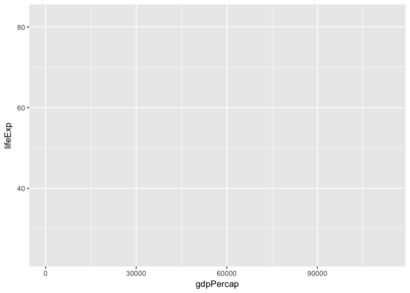<!-- -->

```r
#this will draw the axis but not the points
```

Now that we have the data input we tell ggplot2 *what way* we want to plot the data using the aes (or aesthetics) function.  Here we say that we want to add the geometry points.  This put graphs the data as points.


```r
# next to add points we use the pipe + and add a geom that we use for points
ggplot(data = gapminder, aes(x = gdpPercap, y = lifeExp)) +
  geom_point()
```

<!-- -->


Now lets change the colors of the points


```r
ggplot(data = gapminder, aes(x = gdpPercap, y = lifeExp)) +
  geom_point(color="navyblue")
```

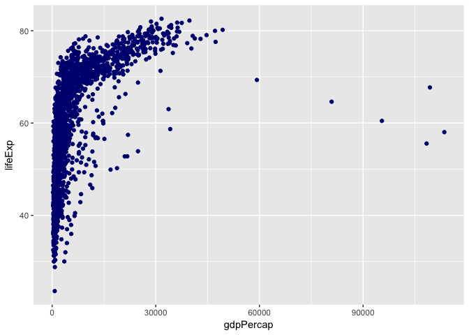<!-- -->

## Geometries

There are many possible geom's available through ggplot.  Here are several examples: https://www.rstudio.com/wp-content/uploads/2015/03/ggplot2-cheatsheet.pdf

Here are a couple of examples

```r
#what other geom's are available
ggplot(data = gapminder, aes(x = gdpPercap, y = lifeExp)) +
  geom_point()
```

<!-- -->

```r
ggplot(data = gapminder, aes(x = gdpPercap, y = lifeExp)) +
  geom_smooth()
```

```
## `geom_smooth()` using method = 'gam'
```

<!-- -->

```r
ggplot(data = gapminder, aes(x = gdpPercap, y = lifeExp)) +
  geom_rug()
```

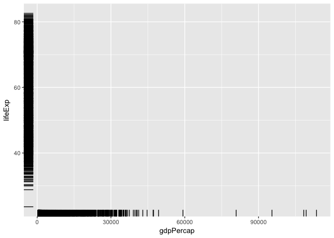<!-- -->

You can combine multiple geoms, here for example we are going to color by continent, group by country


```r
ggplot(data = gapminder, aes(x=gdpPercap, y=lifeExp)) +
  geom_smooth()
```

```
## `geom_smooth()` using method = 'gam'
```

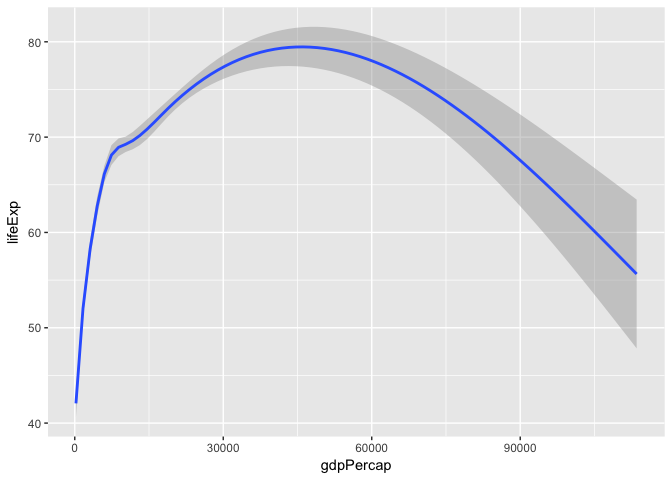<!-- -->

```r
ggplot(data = gapminder, aes(x=gdpPercap, y=lifeExp)) +
  geom_smooth() + geom_rug()
```

```
## `geom_smooth()` using method = 'gam'
```

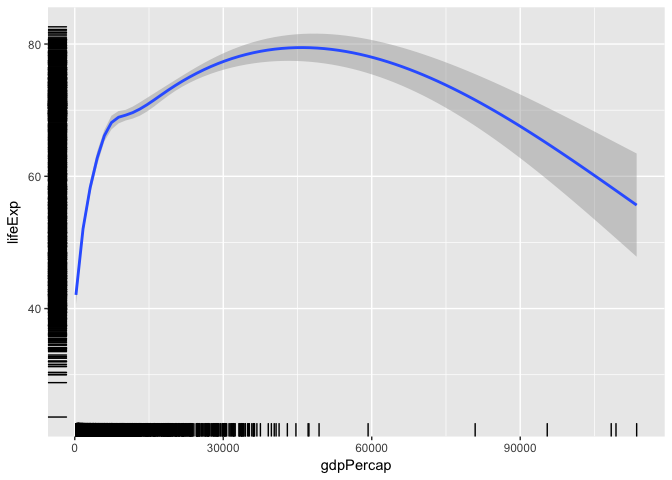<!-- -->

# Challenge #1  (20-35 mins)


```challenge
Modify the example so that the figure shows how life expectancy has changed over time:

ggplot(data = gapminder, aes(x = gdpPercap, y = lifeExp)) + geom_point()
Hint: the gapminder dataset has a column called “year”, which should appear on the x-axis.
```


```challenge
In the previous examples and challenge we’ve used the aes function to tell the scatterplot geom about the x and y locations of each point. Another aesthetic property we can modify is the point color. Modify the code from the previous challenge to color the points by the “continent” column. What trends do you see in the data? Are they what you expected?
```

Take a minute to play around graphing the relationship between the variables, using **geom_point**, **geom_smooth** or **geom_rug**

* year -> Year
* gdpPercap -> GDP per Capita
* lifeExp -> Life Expectancy
* pop -> Population

**Paste your interesting graph code into the etherpad**

# Lineplots and Grouping (25-40 mins)

We are going to move onto how to use lineplots, this was geom_line, looking at the relationship between life expectancy and year.  How would we code this so that the x-axis is the year and the y-axis is life expectancy.  With that set lets draw a lineplot


```r
#draw a line plot
ggplot(data = gapminder, aes(x=year, y=lifeExp)) +
  geom_line()
```

<!-- -->

looks pretty strange but thats becauese it dosent know to draw the lines connecting each country.  So what we are going to do is tell ggplot to group each of these lines by country.  So each country will now have its own line.


```r
ggplot(data = gapminder, aes(x=year, y=lifeExp, by=country)) +
  geom_line()
```

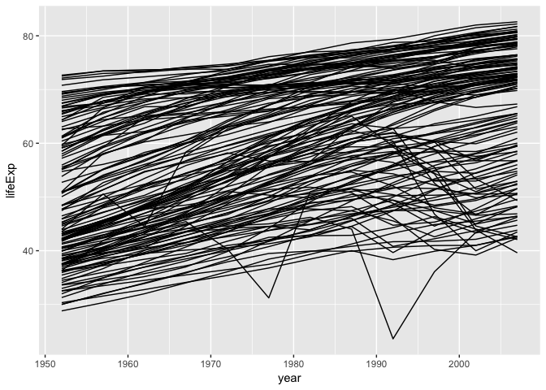<!-- -->

This looks better, now each line is its own country, what do we see here?  Is there any problems with this?  **WAIT FOR A RESPONSE**

Lets add some informative coloring then


```r
ggplot(data = gapminder, aes(x=year, y=lifeExp, by=country, color=continent)) +
  geom_line()
```

<!-- -->

How did this change, is there anything we can see from here?  Notice the figure legend was added automagically

Now, what if we want to seee the points and the lines


```r
ggplot(data = gapminder, aes(x=year, y=lifeExp, by=country, color=continent)) +
  geom_line() + geom_point()
```

<!-- -->

# Scaling (40-45 mins)

Now lets try grouping points by identifying them based on their color or country


```r
#lets go back to the life expectancy vs GDP-per-capita
ggplot(data = gapminder, aes(x = gdpPercap, y = lifeExp)) +
  geom_point()
```

<!-- -->

```r
#now lets color this by continent
ggplot(data = gapminder, aes(x = gdpPercap, y = lifeExp, color=continent)) +
  geom_point()
```

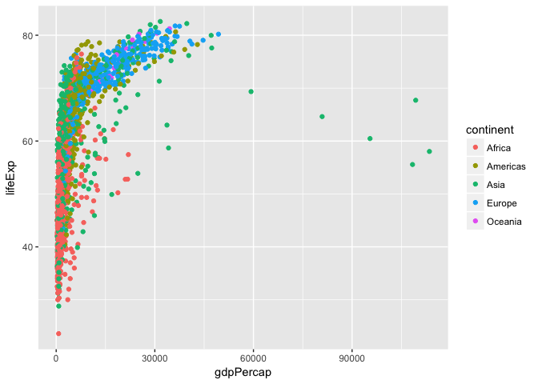<!-- -->

```r
#we could do by country but that looks pretty messy
ggplot(data = gapminder, aes(x = gdpPercap, y = lifeExp, color=country)) +
  geom_point()
```

<!-- -->

This is pretty hard to see because they are all packed together on the left hand side of the axis.Lets use a base 10 log scale on the x-axis


```r
ggplot(data = gapminder, aes(x = gdpPercap, y = lifeExp)) +
  geom_point() + scale_x_log10()
```

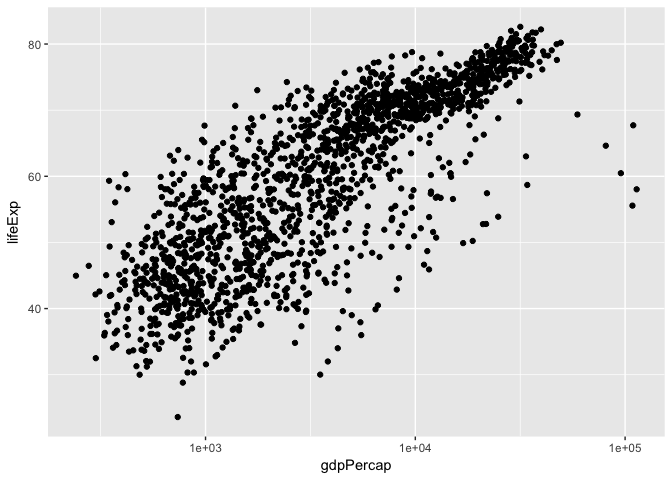<!-- -->

This looks pretty linear once log transformed, lets ask R to draw a best fit line.  We are going to use geom_smooth here indicating `method = lm()` which means linear model.


```r
ggplot(data = gapminder, aes(x = gdpPercap, y = lifeExp)) +
  geom_point() + scale_x_log10() + geom_smooth(method="lm")
```

<!-- -->

What does that tell us? a log increase in GDP/cap is generally a linear increase in life expectancy but there are some outliers.  Lets change the line thickness

## Challenge 4b


```challenge
Modify your solution to Challenge 4a so that the points are now a different shape and are colored by continent with new trendlines. Hint: The color argument can be used inside the aesthetic.
```


```r
ggplot(data = gapminder, aes(x = gdpPercap, y = lifeExp)) +
  geom_point() + scale_x_log10() + geom_smooth(method="lm" , size=0.5)
```

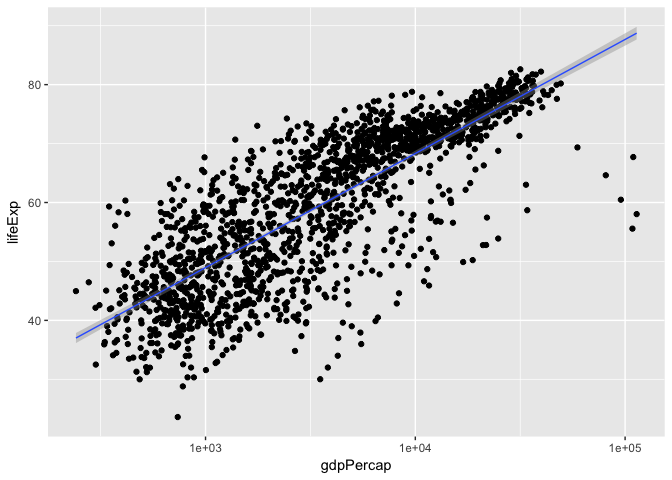<!-- -->

Now lets get rid of the standard error intervals


```r
ggplot(data = gapminder, aes(x = gdpPercap, y = lifeExp)) +
  geom_point() + scale_x_log10() + geom_smooth(method="lm" , se=F)
```

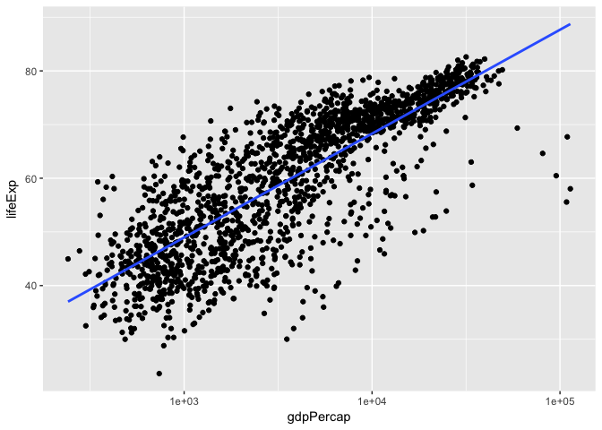<!-- -->

There are several about other statistical fitting methods, can use loess, rlm, glm.  Loess for example does a spline fitting instead of a linear model.  **Try that and describe what you see on the etherpad**.


```r
ggplot(data = gapminder, aes(x = gdpPercap, y = lifeExp)) +
  geom_point() + scale_x_log10() + geom_smooth(method="loess")
```

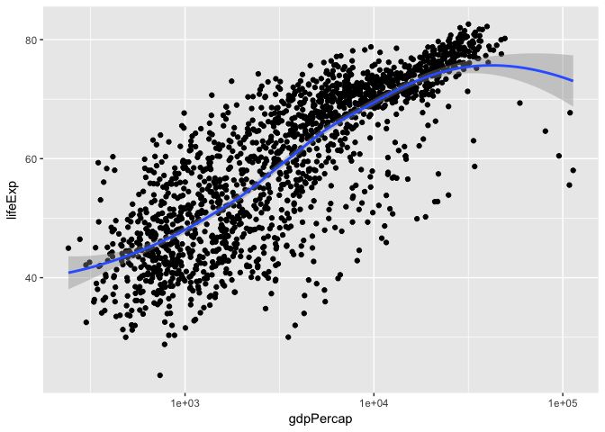<!-- -->

# Multipanel Figures (45-55 mins)

Lets try to color all these by continent


```r
ggplot(data = gapminder, aes(x = gdpPercap, y = lifeExp, color = continent)) +
  geom_point() + scale_x_log10() +
  geom_smooth(method="lm") 
```

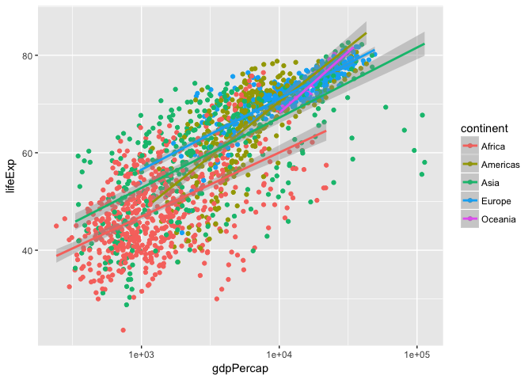<!-- -->

Lots of information but its pretty hard to see, so lets draw a separate graph for each continent.  To do this we are going to use `facet_wrap` or `facet_grid`


```r
ggplot(data = gapminder, aes(x = gdpPercap, y = lifeExp, color = continent)) +
  geom_point() + scale_x_log10() +
  geom_smooth(method="lm")+ facet_wrap( ~ continent)
```

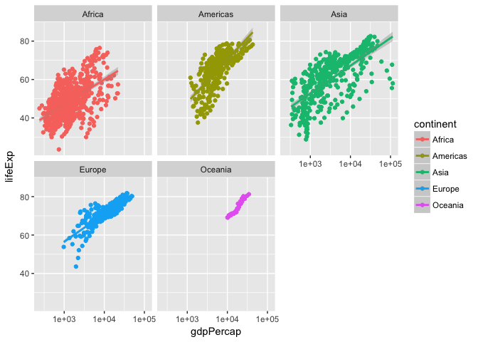<!-- -->

```r
#lets make the points smaller
ggplot(data = gapminder, aes(x = gdpPercap, y = lifeExp, color = continent)) +
  geom_point(size=0.2) + scale_x_log10() +
  geom_smooth(method="lm")+ facet_wrap( ~ continent)
```

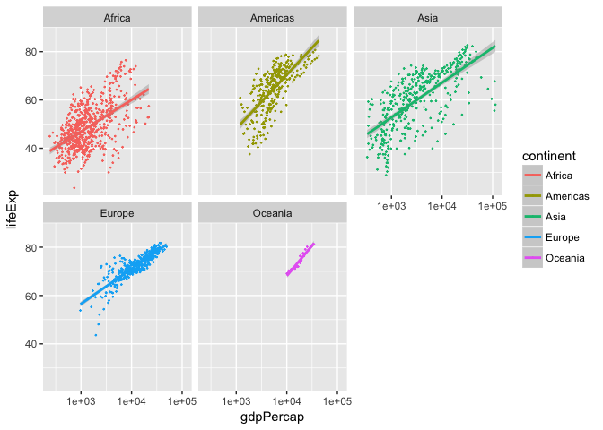<!-- -->

Now lets use facet grid instead, this gives us a little more control


```r
ggplot(data = gapminder, aes(x = gdpPercap, y = lifeExp, color = continent)) +
  geom_point(size=0.2) + scale_x_log10() +
  geom_smooth(method="lm")+ facet_grid(. ~ continent)
```

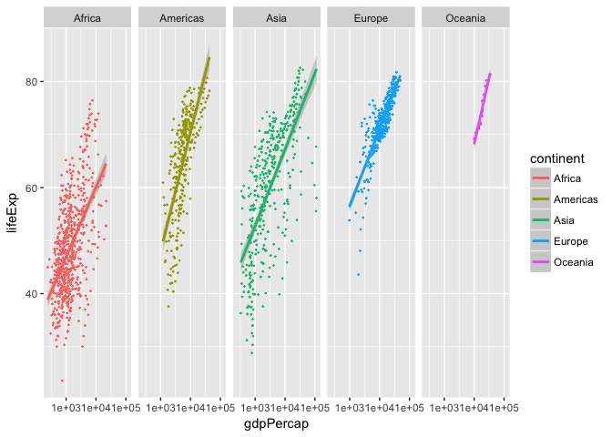<!-- -->

```r
ggplot(data = gapminder, aes(x = gdpPercap, y = lifeExp, color = continent)) +
  geom_point(size=0.2) + scale_x_log10() +
  geom_smooth(method="lm")+ facet_grid(continent ~ .)
```

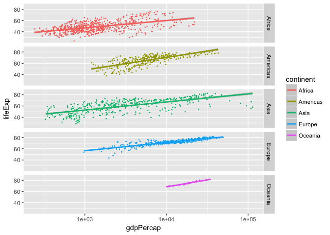<!-- -->


## Other ways to simplify graphs

Lets say we want to look at each country in Africa, to do this we need to subset the data command.


```r
ggplot(data = subset(gapminder, continent=="Africa"), 
       aes(x = year, y = lifeExp)) +
  geom_line() + facet_wrap(~country)
```

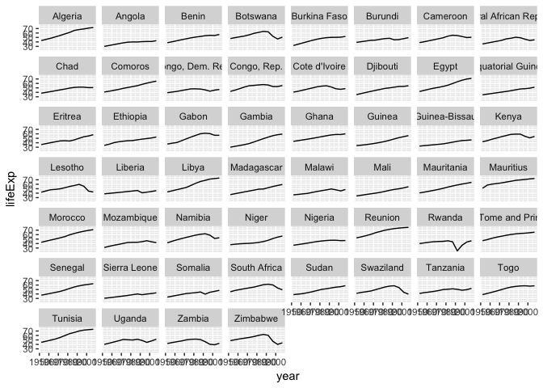<!-- -->

## Labels

Lets make some more pretty labels


```r
ggplot(data = subset(gapminder, continent=="Americas"), aes(x = year, y = lifeExp, color=country)) +
  geom_line() +
labs(
  x = "Year",              # x axis title
  y = "Life expectancy",   # y axis title
  title = "Life expectancy by country",      # main title of figure
  subtitle="Americas only", #subtitle
  color = "Country"      # title of legend
) 
```

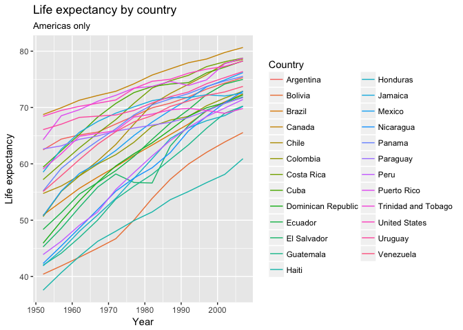<!-- -->

Interesting, I wonder what country that was


```r
ggplot(data = subset(gapminder, continent=="Americas"), aes(x = year, y = lifeExp)) +
  geom_line() +
  labs(
    x = "Year",              # x axis title
    y = "Life expectancy",   # y axis title
    title = "Life expectancy by country",      # main title of figure
    subtitle="Americas only", #subtitle
    color = "Country"      # title of legend
  ) + facet_wrap(~country)
```

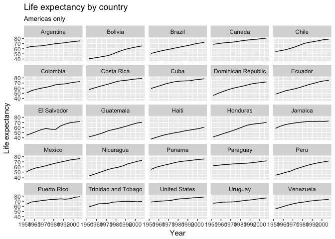<!-- -->

The x axis looks bad here lets remove


```r
ggplot(data = subset(gapminder, continent=="Americas"), aes(x = year, y = lifeExp)) +
  geom_line() +
  labs(
    x = "Year",              # x axis title
    y = "Life expectancy",   # y axis title
    title = "Life expectancy by country",      # main title of figure
    subtitle="Americas only", #subtitle
    color = "Country"      # title of legend
  ) + facet_wrap(~country)  +
  theme(axis.text.x=element_blank(), axis.ticks.x=element_blank())
```

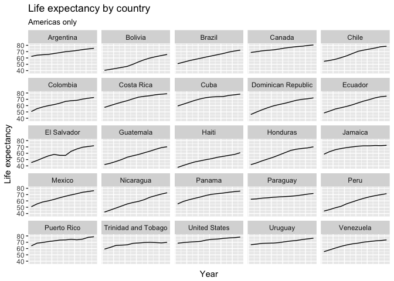<!-- -->

# Final Challenge (55-60 mins)


```challenge
Create a density plot of GDP per capita, filled by continent.  This is `geom_density`

Advanced:

Transform the x axis to better visualise the data spread.
Add a facet layer to panel the density plots by year.
```


Create a density plot of GDP per capita, filled by continent.

Advanced:

* Transform the x axis to better visualise the data spread.
* Add a facet layer to panel the density plots by year.


```r
ggplot(data = gapminder, aes(x = gdpPercap, fill=continent)) +
 geom_density(alpha=0.6) + facet_wrap( ~ year) + scale_x_log10()
```

<!-- -->

# Next up, saving our data!
