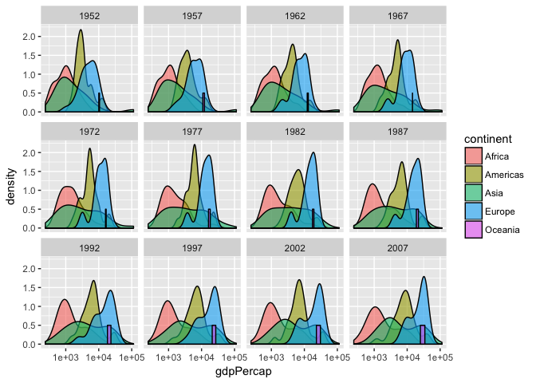

```r
library(ggplot2)
library(gapminder)
ggplot(data = gapminder, aes(x = gdpPercap, fill=continent)) +
 geom_density(alpha=0.6) + facet_wrap( ~ year) + scale_x_log10()
```

<!-- -->

You can save a plot from within RStudio using the ‘Export’ button in the ‘Plot’ window. **Show this** This will give you the option of saving as a .pdf or as .png, .jpg or other image formats.


```r
pdf("Life_Exp_vs_time.pdf", width=12, height=4)
ggplot(data = gapminder, aes(x = gdpPercap, fill=continent)) +
 geom_density(alpha=0.6) + facet_wrap( ~ year) + scale_x_log10()
dev.off()
```

```
## quartz_off_screen 
##                 2
```

This can be repeated with other commands including png or jpg.  **You must remember to close the device**  

 Within ggplot there is another method

# Saving within ggplot


```r
ggplot(data = gapminder, aes(x = gdpPercap, fill=continent)) +
 geom_density(alpha=0.6) + facet_wrap( ~ year) + scale_x_log10()
```

<!-- -->

```r
ggsave("My_most_recent_plot.pdf")
```

```
## Saving 7 x 5 in image
```

# What about saving data

can write as table, excel or csv


```r
library(gapminder)
gapminder
```

```
## # A tibble: 1,704 x 6
##        country continent  year lifeExp      pop gdpPercap
##         <fctr>    <fctr> <int>   <dbl>    <int>     <dbl>
##  1 Afghanistan      Asia  1952  28.801  8425333  779.4453
##  2 Afghanistan      Asia  1957  30.332  9240934  820.8530
##  3 Afghanistan      Asia  1962  31.997 10267083  853.1007
##  4 Afghanistan      Asia  1967  34.020 11537966  836.1971
##  5 Afghanistan      Asia  1972  36.088 13079460  739.9811
##  6 Afghanistan      Asia  1977  38.438 14880372  786.1134
##  7 Afghanistan      Asia  1982  39.854 12881816  978.0114
##  8 Afghanistan      Asia  1987  40.822 13867957  852.3959
##  9 Afghanistan      Asia  1992  41.674 16317921  649.3414
## 10 Afghanistan      Asia  1997  41.763 22227415  635.3414
## # ... with 1,694 more rows
```

```r
write.csv(gapminder, file="Gapminder_data.csv")
```

Can also write as a table (tab separated or excel file)

# Challenge


```saving
Write a data-cleaning script file that subsets the gapminder data to include only data points collected since 1990.

Use this script to write out the new subset to a file in the cleaned-data/ directory.
```
