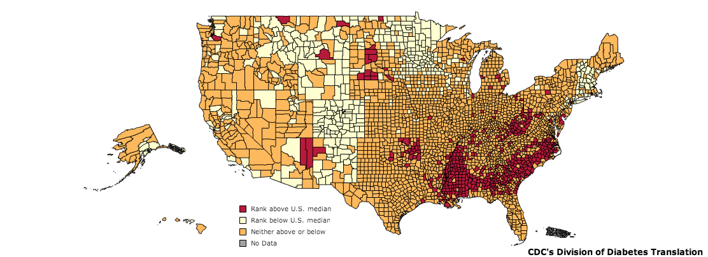

# Lecture Outline

This lecture will cover the roles of insulin and glucagon in normal and pathophyiological states, especially diabetes.  It will focus on pharmacological interventions for both of these pathologies.  This lecture will cover the following four topics.

* Physiological regulation of blood glucose
    * Insulin Signaling
    * Glucagon Signaling
* Pathophysiology related to glucose control
    * Type I Diabetes
    * Type II Diabetes
* Common Pharmacological Interventions for Diabetes

#Diabetes

## Diabetes in the United States.

As of 2011, diabetes affects 25.8 million people or 8.3% of the population.  This includes approximately 7 million undiagnosed individuals.  In addition to this, 79 million Americans over the age of 20 are estimated to be pre-diabetic.  As of 2007, diabetes is estimated to cost $116 billion in direct and $58 billion in indirect costs [@CDC2011].

Diabetes is especially prevalent in this region.  As shown in the map, there is a higher percentage of diabetics in the mid and deep south regions of the United States.

##Complications of Diabetes

The major complications of diabetes include retinopathy, nephropathy, neuropathy and cardiovascular disease including heart attacks and stroke.  These events are primarily due to excessive glycation of extracellular and intracellular targets preventing their function.

## The Discovery of Insulin

![Effects of a dog pancreas isolate on blood glucose levels in a 14 year old diabetic child [@Banting1922a].](figures/banting-insulin.png)

Insulin was discovered by Frederick Banting and his colleagues at the University of Toronto in 1921.  They performed experiments in which they injected extracts from pancreas fractions into dogs which had their pancreas' surgically removed.  They showed that a secreted substance from the pancreas lowered blood glucose in these dogs [@Banting1922].  They were then able to confirm that this treatment was also effective in children with diabetes [@Banting1922a].  This work led to Banting and John Macleod winning the Nobel Prize in Medicine and Physiology in 1923.

# Normal regulation of circulating glucose

Glucose is maintained in a very narrow range, between 4.4 to 6.1 mmol/L.  These levels need to be re-established after changes in feeding status, or energy utilization.  In general, when glucose levels decrease, glucagon is released from alpha cells of the pancreas to promote glucose production, either from glycogen breakdown or gluconeogenesis.  Alternately, after a meal when glucose levels increase, insulin is secreted from beta cells of the pancreas causing glucose levels to decrease.

## Mechanisms of glucose control

For the purposes of the acute maintenance of glucose homeostasis, four organs are the most important; the pancreas, liver, muscle and adipose tissue.  The pancreas senses changes in glucose levels and responds by releasing either glucagon or insulin. 

### Glucose Uptake

Glucose is taken up down a concentration gradient into most tissues including liver, pancreas, kidneys and the brain.  However, for glucose to enter into muscle and fat tissue, insulin is required.  

### Glycolysis

The major route for energy production is glycolysis, the TCA cycle and oxidative respiration in the mitochondria.  This pathway converts glucose and other carbohydrates first into pyruvate, then into components used in the electron transport chain to generate ATP in the mitochondria.  

Glycolysis is regulated both by allosteric activators and inhibitors, as well as by protein phosphorylation in response to extracellular and intracellular signals.

### Gluconeogenesis

Gluconeogenesis is the generation of glucose from non-carbohydrate precursor molecules.  These typically include amino acids, lactate and the products of fatty acid oxidation.  The vast majority of gluconeogenesis occurs in the liver.  This process is similar to reverse glycolysis though in several cases different enzymes are used.  

The rate limiting enzymes in gluconeogenesis are Phosphoenolpyruvate Carboxykinase, Fructose-1,6-bisphosphatase and Glucose-6-Phosphatase.  These enzymes are under both transcriptional and post-translational control as described below.

### Glycogenesis 

As an alternative to glycolysis, glucose can also be stored in esterified form as glycogen.  To form glycogen, glucose must first be converted through Glucose-1-Phosphate into UDP-Glucose.  This activated form of glucose is then added onto existing glycogen chains through the activity of an enzyme named Glycogen Synthase.  In addition to being regulated by protein phosphorylation and sub-cellular location, Glycogen synthase is also allosterically activated by Glucose-6-Phosphate, promoting increased glycogen synthesis when glucose levels in the cell are high.

### Glycogenolysis

To liberate glucose from stored glycogen, glycogen phosphorylase is activated.  This enzyme hydrolyses glycogen releasing glucose-1-phosphate, which can then be dephophorylated into glucose for glycolysis or release into the blood stream.  In addition to post-translational modifications and recruitment to the glycogen pellet by accessory proteins, glycogen phosphorylase is allosterically activated by energy stress such as increases in AMP, or negatively by increases in Glucose-6-Phosphate levels.

<!--- ### Lipogenesis --->

<!--- ### Lipolysis and Lipid Oxidation --->

## Endocrine Control of Blood Glucose

In order to balance the energy requirements of all tissues, blood glucose is primarily controlled via endocrine and neuroendocrine mechanisms.  The primary mediators are insulin and glucagon which are secreted from the pancreas during times of hyper and hypoglycemia respectively.

## Insulin Functions

When glucose levels are raised, such as after a meal, insulin has four main functions, all of which serve to reduce blood glucose levels:

1. Promotes the uptake of glucose from the blood into muscle and adipose tissue.  
2. Enhances the synthesis of glycogen and triglycerides in liver, adipose and muscle.  
3. Insulin inhibits gluconeogenesis, or the production of glucose from non-glucose precursors such as amino acids and lipids.
4. Promote the breakdown of glucose via glycolysis.

### Insulin Secretion

![Regulation of insulin secretion by beta cells in pancreatic islets. [@Dean2004].](figures/insulin-secretion.png)

Beta cells in the pancreas generate insulin and store it in pre-formed secretory granules.  After glucose mediated depolarization of beta cells in response to insulin, these secretory granules are exocytosed and their contentes are released into the blood.

## Insulin Signal Transduction

Insulin functions by binding to and activating a receptor tyrosine kinase.  This receptor transautophosphorylates itself generating binding sites for phosphotyrosine binding proteins known as insulin receptor substrates.

These proteins are also phosphorylated by the insulin receptor, which creates binding sites for a phosphatidylinositol-3-kinase (PI3K).  This kinases generates the key second messenger in insulin signaling, phosphatidylinositol-(3,4,5)-triphosphate (PIP3).  Most known functions of insulin are blocked when PI3K is inhibited [@Kanai1993].

Once PIP3 is generated by insulin stimulation, it can diffuse along the internal membranes of the cells.  This lipid second messenger recruits two important protein kinases, Akt (also referred to as PKB) and PDK1.  Both of these proteins have domains called pleckstrin homology domains which recruit the kinases together to the plasma membrane.  Once there, PDK1 and another protein kinase called mTORC2 are able to phosphorylate and activate Akt.  Once activated, Akt is the most important protein kinase in mediating insulin function.

### Insulin Stimulated Glucose Uptake

In fat and muscle tissue, insulin promotes the movement of a facilitative glucose transporter named GLUT4.  Normally GLUT4 resides in intracellular compartments, but in response to insulin vesicles form these compartments fuse with the plasma membrane, inserting GLUT4 into the extracellular surface.  This allows for glucose to enter fat and muscle cells [@Leto2012].

In both fat and muscle, the PI3K/Akt dependent signaling pathways are absolutely required for insulin stimulated glucose uptake [@Okada1994].  The major targets of Akt in this signaling pathway are AS160 and RGC1/2, two proteins which regulate the activity of small GTPases involved in GLUT4 translocation [@Leto2012].  These mechanisms are not yet fully understood.

### How Does Insulin Stimulate Glycogenesis

Allosterically, the other functions of insulin, including promoting glucose uptake and glycolysis will provide more UDP-Glucose for glycogen synthase, and will also allosterically activate the enzyme by generating large amounts of Glucose-6-Phosphate.  

In addition to these allosteric activators, both glycogen synthase and glycogen phosphorylase are regulated by protein phosphorylation.  In the case of glycogen synthase, the phosphorylated form is relatively inactive, and is resistant to allosteric activation by glucose-6-phosphate [@Friedman1963].  Glycogen synthase is phosphorylated by several protein kinases including AMPK and GSK-3 [@Parker1982].  In addition to inactivating the upstream kinases, insulin also activates a protein phosphatase, which removes the phosphate groups.  

In a co-ordinated way, protein phosphorylation activates glycogen phosphorylase [@Krebs1964].  This means that when these enzymes are phosphorylated, the balance tips towards glycogenolysis, and when they are dephosphorylated glycogen is synthesized.

<!--- ### What are the Mechanisms of Insulin Stimulated Lipogenesis --->

<!--- ### How Does Insulin Suppress Lipolysis and Lipid Oxidation --->

### How Does Insulin Suppress Gluconeogenesis

The activation of glucose uptake and glycolysis leads to increased levels of several glycolytic intermediates which themselves will regulate gluconeogenesis.  The most important of these is Fructose-2,6-bisphosphate which is raised during glycolysis and inhibits FBPase, one of the key rate limiting steps in gluconeogenesis.

In addition to these effects, both G6Pase and PEPCK, two other rate limiting enzymes are regulated transcriptionally.  Akt phosphorylates and inactivates the transcription factor FOXO which would normally drive the expression of these enzymes.  Therefore when insulin activate the PI3K/Akt cascade, FOXO mediated transcription of G6Pase and PEPCK is decreased and the levels of these enzymes are reduced, decreasing gluconeogenesis.

## How Is Blood Glucose Increased?

### Physiological effects of glucagaon
 When glucose levels are low, glucagon is released from alpha cells in the pancreas.  This promotes the breakdown of glycogen stores in liver and muscle, and the generation of glucose from gluconeogenic precursors.  Glucagon receptors exist mainly in the liver, so glucagon does not exert its catabolic effects on either adipose or muscle tissue [@Drucker2003]. 
 
### Regulation of glucagon release

The mechanisms which underlie hypoglycemia induced glucagon are incompletely understood.  What is clear however, is that when blood glucose levels decrease, glucagon is released from the alpha cells of the pancreas into the portal vein.

### Glucagon signaling

Adrenergic-receptor coupled mediated cAMP synthesis was the first example of a hormonal second messenger.  Earl Sutherland was interested in the regulation of glycogenolysis and he noticed that if he added adrenaline to intact cells, he could accelerate glycogen breakdown, but if he added it to lysed cells he could not.  In his key experiment he treated one set of livers with adrenaline, then lysed them.  He then added that lysate to a second set of livers which had already been broken.  He found that there was an internal factor (later identified by cAMP) in the stimulated tissues, that could accelerate glycogenolysis in the other tissues [@Rall1956].  For this work, Sutherland won the Nobel Prize in Medicine and Physiology in 1971.

In metabolism, the main effector of cAMP in cells is Protein Kinase A (PKA).  This protein kinase is allosterically activated by cAMP and phosphorylates a wide variety of important metabolic substrates.  The identification of PKA and its role in carbohydrate homeostasis led to Fisher and Krebs winning the Nobel Prize in Medicine and Physiology in 1992.  The major role of glucagon is to stimulate glucose release, both by mobilizing glycogen stores and inducing gluconeogenesis.

### Effects of glucagon on glycolysis.

As described above, glucagon stimulates the breakdown of glycogen.  This proceeds via protein phosphorylation of both glycogen phosphorylase (which activates the enzyme) and glycogen synthase (which inactivates the enzyme).  In combination, this leads to a breakdown of glycogen into glucose.

PKA is the primary mediator of the activation of glycogen phosphorylase.  Once activated by adrenergic signaling, PKA phosphorylates and activates glycogen phosphorylase kinase.  This kinase in turn, phosphorylates and activates glycogen phosphorylase [@Krebs1956].  PKA also directly phosphorylates glycogen synthase, which in concert with the activation of the other glycogen synthase kinases (notably GSK3 and AMPK) leads to increased phosphorylation and inactivation of glycogen synthase.

In addition to the activation of these protein kinases, there is a reduction of glycogen associated protein phosphatase activity.  As a balance, this leads to more highly phosphorylated and therefore more glycogenolytic activities.

### How does glucagon promote gluconeogenesis?

In addition to the decreased flux of glycolytic intermediates which allosterically activate gluconeogenesis, there are both post-translational and transcriptional mechanisms by which adrenergic signaling promotes gluconeogenesis.  

Post-translationally, the best studied route by which PKA activates gluconeogenesis is through inactivation of phosphofructokinase-2.  PFK-2 normally generates the carbohydrate Fructose-2,6,-bisphosphate which is a positive regulator of glycolysis and a negative regulator of gluconeogenesis.  The alleviation of this inhibition allows for promotion of the gluconeogenic metabolism.

Transcriptionally, the transcription factor CREB is phosphorylated by PKA where it plays a role in transcriptionally activating the rate limiting gluconeogenic enzymes PEPCK, FPBase and G6Pase.

## Exercise and Sympathetic Tone

### Adrenaline and the Sympathetic Nervous System

Since glucagon works primarily on liver tissue, different hormonal messengers function to stimulate catabolism in muscle and fat tissue.  The activation of PKA by GPCR and cAMP signaling pathways leads to glycogen breakdown in muscle via similar mechanisms as those in liver.  Adrenaline also leads to enhanced lipid and glucose oxidation in muscle primarily as an energy source.

In adipose tissue, these pathways induce lipolysis, via phosphorylation and activation of Hormone Sensitive Lipase (HSL), Perilipin and Adipocyte Triglyceride Lipase (ATGL).  These proteins function to mobilize triglycerides into free fatty acids for use in other tissues, especially muscle.  For more information on the regulation of lipolysis, see [@Young2013].  At an acute level, these do not contribute much to glucose homeostasis.

### The AMPK Activated Protein Kinase

Intracellularly, when levels of ATP decrease and correspondingly, the levels of AMP rise, a protein kinase called the AMP Activated Protein Kinase is turned on.  AMPK is like a cellular fuel gauge, so that when ATP levels are decreased, energy producing pathways are activated and energy using pathways are reduced [@Hardie2012].

# Pathophysiology related to glucose control

## Type I Diabetes Mellitus

Type I Diabetes is typically caused by autoimmune destruction of pancreatic beta cells.  Without these cells, the pancreas is unable to produce insulin and without careful monitoring and exogenous insulin, blood glucose levels will rise.

## Insulin Resistance and Type II Diabetes Mellitus

Type II diabetes occurs as a result of a multi-step process starting with negative feedback loops on insulin signaling.  As more nutrients are stored, metabolic tissues become resistant to the effects of insulin, likely as a way to protect against excessive lipid storage.

As tissues become more insulin resistant, more insulin must be secreted by the pancreas to maintain normoglycemia.  If insulin resistance proceeds, more and more insulin will need to be produced and secreted by beta cells.  Eventually the beta cells will be unable to keep up with this demand and glucose levels will rise as the amount of endogenous or exogenous insulin is less and less effective.

### Why Insulin Resistance

Insulin resistance is a standard negative feeback loop, common in most endocrine pathways.  Normally, it serves to ensure that anabolic pathways are not over-active.  Evolutionarily, it has been hypothesized that our carbohydrate and lipid homeostatic mechanisms are wired to promote lipid storage since during the majority of human existence, excessive nutrient storage was not problematic [@Neel1999]. 

There is both an adaptive and a genetic component to the extent of insulin resistance.  Some obese individuals are able to maintain insulin sensitivity to a greater extent, while others progress from moderate insulin resistance to pancreatic failure rather quickly.  These variations, which are largely consistent between ethnic groups underlie how rapidly and severely individuals may progress towards Type II diabetes.

### Molecular mechanisms of insulin resistance

Obese individuals respond poorly to insulin, including less insulin stimulated glucose uptake, and less insulin suppression of glucose production in the liver.  Biochemical measurements were done to dissect these processes.  These studies showed the activity of the PI3K signaling pathways were reduced in obese states [@Goodyear1995][@Saad1992].  This is thought to occur via serine phosphorylation of insulin receptor substrate proteins [@Takayama1984][@White1985].  This prevents these substrates from being phosphorylated by the insulin receptor tyrosine kinase and prevents the activation of the PI3K signal transduction cascade.

### Mechanisms of Insulin Resistance

There have been three primary mechanisms suggested in recent years by which insulin receptor substrate serine phosphorylation is stimulated.  These involve the activation of  mTORC1/S6K, PKC and JNK protein kinase cascades.  None of these has been conclusively proven to be the physiologically relevant primary pathway, and intensive research is still being done in this area.  These cascades are also overlapping at times, so it is possible that insulin resistance associated IRS serine phosphorylation is multi-factoral.

#### Nutrient overload induced insulin resistance

The nutrient sensing kinase mTORC1 is regulated by a variety of nutritional cues including energy status (via AMPK), insulin signaling (via Akt/TSC), amino acid levels and inflammatory cues.  When activated by high nutrient levels, mTORC1 activates another protein kinase named S6K.  Associated with the activation of S6K by mTORC1 is enhanced serine phosphorylation of IRS1 and therefore reduced insulin signaling.  S6K has been shown to phosphorylate IRS1 *in vivo* and the knockout of this kinase results in animals which are lean and insulin sensitive [@Um2004a].

#### Lipid mediated insulin resistance

Intracellular triglyceride levels have also been shown to be associated with insulin resistant tissues in some but not all cases.  One of the pathways by which these intracellular lipids has been proposed to result in insulin resistance is via the activation of PKC theta and serine phosphorylation of IRS [@Samuel2012b].  PKC is activated by diacylglycerol (triaclyglycerol with one fatty acid removed), so it has been proposed that increased lipids (mainly diacylglycerol) activate PKC inducing insulin resistance.  This has been supported by data showing that knockout mice without PKC theta have reduced lipid-induced insulin resistance [@Kim2004a].

#### Inflammation associated insulin resistance

The third proposed mechanism by which insulin resistance is established in response to nutrient excess is linked to the finding that obesity is also a state of chronic low grade inflammation [@Lumeng2011].  Compelling evidence now exists that in obese states, adipose muscle and liver tissues become infiltrated with inflammatory cells including macrophages.  These cells secrete pro-inflammatory cytokines such as IL6 and TNFa which in turn are able to signal to the adjacent cells.  These cytokines activate pathways including JNK and IKK signaling cascades and these kinases have been proposed to enhance serine phosphorylation of IRS1 [@Gregor2010].

### How Does Insulin Resistance Lead to Hyperglycemia and Diabetes?

Resistance to the effects of insulin, associated with obesity can contribute to hyperglycemia through a variety of mechanisms including reduced glycolysis and reduced insulin stimulated glucose uptake.  The primary mechanism however is the reduced ability of the liver to suppress gluconeogenesis when insulin is present.  This uncontrolled gluconeogenesis, along with the abundant supply of gluconeogenic precursors in obese states leads to a constant over production of glucose which cannot be properly disposed of in tissues.  

This is best illustrated in liver specific insulin receptor knockout mice.  These mice are genetically engineered to not be able to respond to insulin in their liver tissues and as such have impaired insulin suppression of gluconeogenesis.  As a consequence these animals become hyperglycemic and hyperinsulinemic [@Michael2000][@Fisher2003].

### Adaptations to Insulin Resistance
* Hyperinsulinemia -> Pancreatic Failure
* Regulation of food intake

# Common Pharmacological Interventions for Diabetes
* Primary intervention is diet and exercise alteration

## Treatments for Type I Diabetes

### Insulin Administration

The amino acid sequence of insulin was determined by Frederick Sanger, which led to him winning the Nobel Prize in Chemistry in 1958 [@Sanger1951].  This eventually allowed for recombinant production and manipulation of insulin, rather than using purified porcine, ovine or bovine insulin.

#### Short and Long Acting Insulin

#### Insulin Pumps

### Islet Transplantation

## Treatments for Type II Diabetes

### Excretion of circulating glucose

### Storage of circulating glucose

#### Insulin administration and insulin secretagogues

* Sulfonylureas

#### Drugs that promote insulin sensitivity

* Thiazolidinediones
* Anti-inflammatories

## Glucose Utilization

One class of drugs called biguanides is a common therapeutic for Type II Diabetes.  These drugs, such as phenformin and metformin (marketed as Glucophage) function by disrupting mitochondrial function.   These leads to energy stress and activation of AMPK due to the increases in intracellular AMP [@Zhou2001].  The activation of AMPK leads to activation of energy producing pathways, including glucose uptake and oxidation and lipid oxidation.
The effects of this are to reduce circulating glucose, while also burning fat.

# Further Reading
