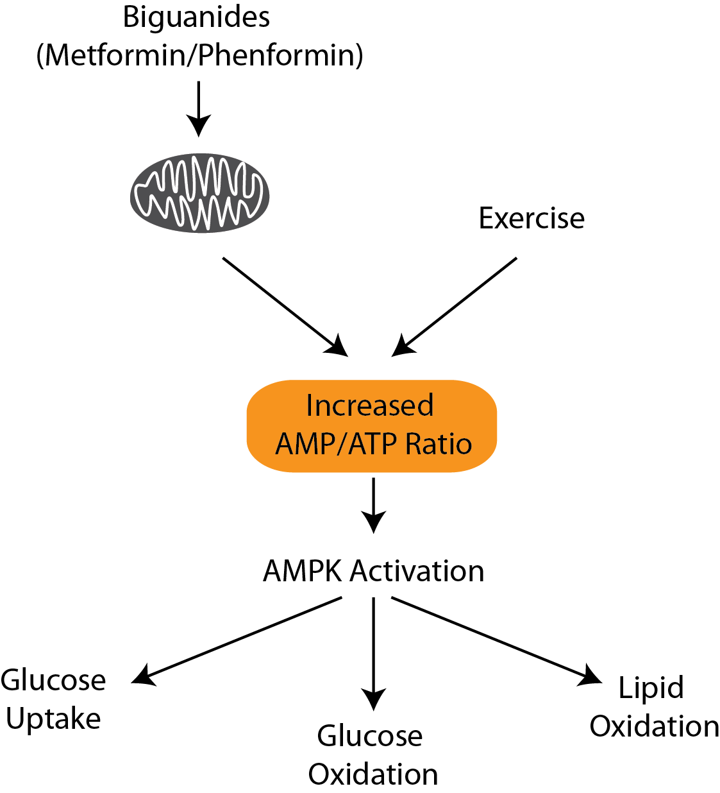

# Lecture Outline

This lecture will cover the roles of insulin and glucagon in normal and pathophyiological states, especially diabetes.  It will focus on pharmacological interventions for both of these pathologies.  This lecture will cover the following four topics.

* Physiological regulation of blood glucose
    * Insulin Signaling
    * Glucagon Signaling
* Pathophysiology related to glucose control
    * Type I Diabetes
    * Type II Diabetes
* Common Pharmacological Interventions for Diabetes

#Diabetes

## Diabetes in the United States.

As of 2011, diabetes affects 25.8 million people or 8.3% of the population.  This includes approximately 7 million undiagnosed individuals.  In addition to this, 79 million Americans over the age of 20 are estimated to be pre-diabetic.  As of 2007, diabetes is estimated to cost $116 billion in direct and $58 billion in indirect costs [@CDC2011].

Diabetes is especially prevalent in this region.  As shown in the map, there is a higher percentage of diabetics in the mid and deep south regions of the United States.

##Complications of Diabetes

The major complications of diabetes include retinopathy, nephropathy, neuropathy and cardiovascular disease including heart attacks and stroke.  These events are primarily due to excessive glycation of extracellular and intracellular targets preventing their function.

## The Discovery of Insulin

![Effects of a dog pancreas isolate on blood glucose levels in a 14 year old diabetic child [@Banting1922a].](figures/banting-insulin.png)

Insulin was discovered by Frederick Banting and his colleagues at the University of Toronto in 1921.  They performed experiments in which they injected extracts from pancreas fractions into dogs which had their pancreas' surgically removed.  They showed that a secreted substance from the pancreas lowered blood glucose in these dogs [@Banting1922].  They were then able to confirm that this treatment was also effective in children with diabetes [@Banting1922a].  This work led to Banting and John Macleod winning the Nobel Prize in Medicine and Physiology in 1923.

# Normal regulation of circulating glucose

Glucose is maintained in a very narrow range, between 4.4 to 6.1 mmol/L.  These levels need to be re-established after changes in feeding status, or energy utilization.  In general, when glucose levels decrease, glucagon is released from alpha cells of the pancreas to promote glucose production, either from glycogen breakdown or gluconeogenesis.  Alternately, after a meal when glucose levels increase, insulin is secreted from beta cells of the pancreas causing glucose levels to decrease.

## Mechanisms of glucose control

For the purposes of the acute maintenance of glucose homeostasis, four organs are the most important; the pancreas, liver, muscle and adipose tissue.  The pancreas senses changes in glucose levels and responds by releasing either glucagon or insulin. 

### Glucose Uptake

### Gluconeogenesis

### Glycogenesis 

### Glycolysis

<!--- ### Lipogenesis --->

<!--- ### Lipolysis and Lipid Oxidation --->

## Endocrine Control of Blood Glucose

## Insulin Functions

When glucose levels are raised, such as after a meal, insulin has four main functions:

1. Promotes the uptake of glucose from the blood into muscle and adipose tissue.  
2. Enhances the synthesis of glycogen and triglycerides in liver, adipose and muscle.  
3. Insulin inhibits gluconeogenesis, or the production of glucose from non-glucose precursors such as amino acids and lipids.

## Insulin Signal Transduction

### Insulin Secretion

![Regulation of insulin secretion by beta cells in pancreatic islets. [@Dean2004].](figures/insulin-secretion.png)

Beta cells in the pancreas generate insulin and store it in pre-formed secretory granules.  After glucose mediated depolarization of beta cells in response to insulin, these secretory granules are exocytosed and their contentes are released into the blood.

### Insulin Stimulated Glucose Uptake

### How Does Insulin Stimulate Glycogenesis

<!--- ### What are the Mechanisms of Insulin Stimulated Lipogenesis --->

<!--- ### How Does Insulin Suppress Lipolysis and Lipid Oxidation --->

### How Does Insulin Suppress Gluconeogenesis

## How Is Blood Glucose Increased

### Glucagon Secretion

### Glucagon Signaling

### How Does Glucagon Regulated Glyogenolysis

### What Are the Mechanisms of Glucose

## Glucagon Signaling

### Physiological effects of glucagaon
 When glucose levels are low, glucagon promotes the breakdown of glycogen stores in liver and muscle, and the generation of glucose from gluconeogenic precursors primarily in the liver.  
 
### Regulation of glucagon release

### Glucagon signaling

### Effects of glucagon on gluconeogenesis

### How does glucagon promote gluconeogenesis

## Exercise and Sympathetic Tone

### Adrenaline and the Sympathetic Nervous System

Since glucagon works primarily on liver tissue, different hormonal messengers function to stimulate catabolism in muscle and fat tissue.  The activation of PKA by GPCR and cAMP signaling pathways leads to glycogen breakdown in muscle via similar mechanisms as those in liver.  Adrenaline also leads to enhanced lipid and glucose oxidation in muscle primarily as an energy source.

In adipose tissue, these pathways induce lipolysis, via phosphorylation and activation of Hormone Sensitive Lipase (HSL), Perilipin and Adipocyte Triglyceride Lipase (ATGL).  These proteins function to mobilize triglycerides into free fatty acids for use in other tissues, especially muscle.  For more information on the regulation of lipolysis, see [@Young2013].  At an acute level, these do not contribute much to glucose homeostasis.

### The AMPK Activated Protein Kinase

Intracellularly, when levels of ATP decrease and correspondingly, the levels of AMP rise, a protein kinase called the AMP Activated Protein Kinase is turned on.  AMPK is like a cellular fuel gauge, so that when ATP levels are decreased, energy producing pathways are activated and energy using pathways are reduced [@Hardie2012].

# Pathophysiology related to glucose control

## Consequences of dysfunctional glucose homeostasis

### Hypoglycemia
* Feinting, dizziness
* Diabetic ketoacidosis

### Hyperglycemia
* Chronic hyperglycemia leads to glycation of membrane proteins.  This leads to damaged nerves, kidneys, eyes, circulatory system (amputation) and Alzheimer's disease.
* Hyperglycemic hyperosmolar nonketotic syndrome.

## Type I Diabetes Mellitus

### Loss of Insulin Producing Cells

## Insulin Resistance and Type II Diabetes Mellitus

### Obesity and Insulin Sensitivity

### Why Insulin Resistance

### Molecular mechanisms of insulin resistance

Obese individuals respond poorly to insulin, including less insulin stimulated glucose uptake, and less insulin suppression of glucose production in the liver.  Biochemical measurements were done to dissect these processes.  These studies showed the activity of the PI3K signaling pathways were reduced in obese states [@Goodyear1995][@Saad1992].  This is thought to occur via serine phosphorylation of insulin receptor substrate proteins [@Takayama1984][@White1985].  This prevents these substrates from being phosphorylated by the insulin receptor tyrosine kinase and prevents the activation of the PI3K signal transduction cascade.

### IRS Serine Phosphorylation

### Mechanisms of Insulin Resistance

#### Nutrient overload induced insulin resistance
#### Lipid mediated insulin resistance
#### Inflammation associated insulin resistance

### How Does Insulin Resistance Lead to Hyperglycemia and Diabetes?

### Adaptations to Insulin Resistance
* Hyperinsulinemia -> Pancreatic Failure
* Regulation of food intake

# Common Pharmacological Interventions for Diabetes
* Primary intervention is diet and exercise alteration

## Treatments for Type I Diabetes

### Insulin Administration

The amino acid sequence of insulin was determined by Frederick Sanger, which led to him winning the Nobel Prize in Chemistry in 1958 [@Sanger1951].  This eventually allowed for recombinant production and manipulation of insulin, rather than using purified porcine, ovine or bovine insulin.

#### Short and Long Acting Insulin

#### Insulin Pumps

### Islet Transplantation

## Treatments for Type II Diabetes

### Excretion of circulating glucose

### Storage of circulating glucose

#### Insulin administration and insulin secretagogues

* Sulfonylureas

#### Drugs that promote insulin sensitivity

* Thiazolidinediones
* Anti-inflammatories

## Glucose Utilization

One class of drugs called biguanides is a common therapeutic for Type II Diabetes.  These drugs, such as phenformin and metformin (marketed as Glucophage) function by disrupting mitochondrial function.   These leads to energy stress and activation of AMPK due to the increases in intracellular AMP [@Zhou2001].  The activation of AMPK leads to activation of energy producing pathways, including glucose uptake and oxidation and lipid oxidation.
The effects of this are to reduce circulating glucose, while also burning fat.

# Further Reading
